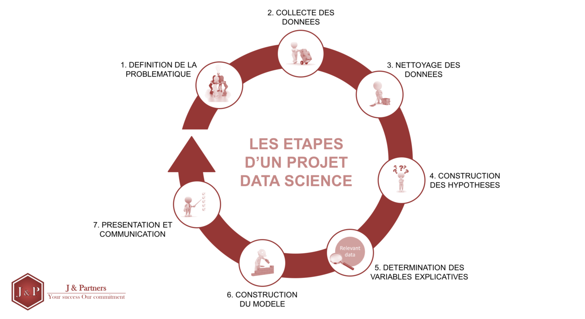

#### Example Golang 
###### [Essential Golang](https://www.programming-books.io/essential/go/) 

#### testjs https://stackblitz.com/edit/react-drrmuk?file=index.js


L’intérêt grandissant autour de la Data Science et d’autres buzzwords tels que le « Machine Learning » ou la « Data visualization » nous a donné envie d’apporter des éclairages sur ce sujet. Cet article a pour ambition de dresser un portrait synthétique des étapes qui structurent tout projet de Data Science : définition des objectifs, collecte des données, nettoyage de ces dernières, construction d’hypothèses, identification des variables synthétiques, construction du modèle prédictif et présentation des résultats.

Bien entendu, il existe de multiples analyses et interprétations du cycle de vie d’un projet Data Science. Chaque étape décrite ci-dessous ne peut être analysée isolement. Un projet Data Science est un processus itératif et des allers et retours entre les différentes étapes sont la norme. Par exemple c’est en nettoyant les données que l’on peut mettre en lumière des hypothèses et réaliser que d’autres données peuvent être pertinentes à collecter.

Notre article résulte de nos lectures et de nos échanges avec les acteurs de cet écosystème (data engineer, data scientist, consultant BI, etc.). La Data Science est un domaine en constante évolution et il en va de même de sa définition et de ses contours.

N’hésitez pas à nous faire part de vos commentaires. Nous serons ravis d’en prendre connaissance, d’affiner notre compréhension du sujet et ainsi de diffuser une information des plus qualitatives à notre réseau.

#### 1. Compréhension du problème métier
Le data scientist a pour objectif de s’assurer que l’ensemble des décisions prises dans une entreprise repose sur des données de qualité. En d’autres termes, il a pour ambition de mettre la donnée au cœur des décisions !

Avant de se lancer dans un projet de Data Science, il est fondamental de comprendre l’environnement dans lequel ce professionnel va intervenir (Quelle industrie ? Quel service ? Quels enjeux opérationnels ? Quelle réglementation en vigueur ? etc.) puis de définir la problématique à résoudre.

Selon la littérature, le data scientist peut répondre à cinq types de questions :
* Quelle quantité ? (régression)
* Est-ce A ou B ? (classification)
* Comment les données sont-elles organisées? (clustering)
* Est-ce étrange ? (détection d’anomalie)
* Que devons-nous faire ensuite ? (apprentissage par renforcement)

Lors de cette étape le data scientist doit échanger avec les responsables métiers pour comprendre la problématique à résoudre et identifier les variables à prédire : Prévisions de ventes (régression), profil client (clustering), « Qu’est-ce qui attire le plus les clients : un coupon de 5 € ou une remise de 25 % ? » (classification), etc.

Nous insistons ici sur le fait que la compréhension des données et la manière de les exploiter en se posant de bonnes questions est un processus autant essentiel que délicat. Ce processus est, selon nous, plus un art qu’une science. Se poser les « bonnes questions » et « faire le tri entre l’essentiel et l’accessoire » nécessitent beaucoup d’expérience. Une manière d’acquérir cette expérience est d’échanger avec des experts métiers, des data scientists chevronnés et de développer sa sensibilité métier à travers des lectures ou tout autre support.

#### 2. Collecte des données: 

Une fois les objectifs du projet bien définis, il est alors temps de collecter les données.

Malheureusement, il est très rare (voire naïf) de penser que l’ensemble des données est stocké à un même endroit et servi sur un plateau d’argent. La plupart du temps, la collecte de données est consommatrice de temps et d’énergie. Ainsi, le data scientist doit avoir une vision claire et exhaustive des données à collecter, identifier les sources où obtenir ces données, savoir y accéder et les stocker.

Une partie des données peut être regroupée dans une ou plusieurs bases de données (bdd). Le travail est alors simplifié. Deux situations peuvent se présenter. Le data scientist dispose de bdd accessibles, documentées et aux données structurées (data warehouse). Le data scientist doit trouver les bdd dans son entreprise et doit récupérer des données peu structurées via des requêtes (requêtes SQL , etc.).

L’extraction de données peut également passer par du Web scraping. "Beautiful Soup" est une librairie de Web scraping qui permet d’extraire les données de pages web et de les structurer. Si elle présente un intérêt certain, ce sont rarement des données utilisables en production parce que cette méthode s’apparente à voler des données sur un site… sauf autorisation explicite contraire (type Wikipedia).

La collecte de données externes peut se faire via recours à des API (interface de programmation). Ces API sont implémentées par les développeurs de l’entreprise afin d’effectuer des actions sur un système extérieur. Lorsque ces interfaces sont établies, le data scientist peut requêter via un lien url. Par exemple un data scientist souhaitant collecter des données météo peut souscrire à l’API « OpenWeatherMap ».

Enfin, si le data scientist souhaite collecter de la donnée sur un site web/ application mobile pour obtenir des informations telles que le nombre de visites, les pages visitées, les actions réalisées, etc. de nombreux outils existent tels que Google Analytics.

#### 3. Nettoyage des données:

Une fois la collecte de données achevée, le data scientist passe à l’étape la plus chronophage du projet (50 à 80% du temps) : le nettoyage et la mise en forme des données.

Outre la volumétrie des données, la dimension chronophage de cette étape s’explique notamment par de nombreux allers - retours entre le data scientist et le métier. En effet la bonne compréhension de l’environnement étudié est primordial afin de ne pas omettre certaines informations et ainsi ne pas biaiser l’analyse des données. Notons aussi qu’à l’ère des projets Big Data, la volumétrie des données est de plus en plus conséquente (plusieurs téraoctets de données).

Dès lors, il nous semble intéressant de comprendre en quoi consiste cette étape.

Les données provenant de différentes sources peuvent avoir des formats différents (csv, json, xml,etc.) et contenir des anomalies ou des valeurs incorrectes. Les problèmes de qualité les plus fréquents sont les suivants :

* Les données erronées : elles proviennent le plus souvent d’erreurs de saisie ou d’incompatibilités entre la source de données et la base.

    - Les données incomplètes : il est fréquent que les utilisateurs d’une base de données ne renseignent que les champs obligatoires ou ceux qui les concernent dans leur activité. Des autres données, pourtant pertinentes, passent ainsi à la trappe.

    - Les données non normées : plusieurs utilisateurs renseignent une donnée identique sous des formats différents. Par exemple, un individu de sexe masculin sera renseigné M., Mr ou Monsieur.

    - Les données obsolètes : une entreprise a fermé, a déménagé, ou encore Mr X a remplacé Mr Y, etc. et la qualité de la base se détériore.

    - Les doublons : un même contact se retrouve plusieurs fois dans la base. Et le data scientist s’arrache les cheveux pour retrouver la fiche-source et fusionner les données.

L’ensemble de ces problèmes peut engendrer des erreurs dans la détermination des hypothèses et des biais dans la construction du modèle prédictif.

Différents outils et méthodes existent pour nettoyer et restructurer cette donnée. Par exemple, dans le cas des données manquantes, le data scientist peut supprimer les données manquantes ou les remplacer par des valeurs artificielles (on parle d’imputation).

Lors de cette phase, le data scientist a majoritairement recours à pandas (pour python) ou Dplyr/ Data.table (pour R). Ces librairies permettent de manipuler les données (filtrer, trier, regrouper, fusionner, pivoter, etc.). L’objectif de cette manipulation est de les mettre à un « meilleur » format pour faciliter l'exploration des données (et la formulation des hypothèses) ou même l’apprentissage du modèle de machine learning.

#### 4. Formulation des hypothèses
En possession d’un jeu de données complet, correctement retraité et fidèle à l’activité/ au problème à résoudre, le data scientist peut débuter l’analyse des données. Il rentre alors dans une phase de travail qui peut s’associer à un exercice de brainstorming.

L’objectif est de croiser les différentes natures de données et d’établir des liens de corrélation entre ces dernières. Ces liens doivent se matérialiser par la formulation d’hypothèses. Par exemple, dans le cas d’une estimation d’un prix de vente d’un bien immobilier, un jeu de données pertinemment choisi inclura la localisation, la superficie, le rendement locatif, l’âge et la qualité de la construction, les équipements, etc. Une hypothèse pouvant être établie est la relation prix de vente/ localisation.

Cette analyse de données peut être facilitée par la mise en place d’histogrammes et/ ou de courbes de distribution, diagrammes de dispersion permettant de dégager des tendances. Par ailleurs des outils de restitutions tels que Power BI ou Qlickview peuvent faciliter ce travail de brainstorming via des visualisations interactives.

Rappel : Cette phase très descriptive se fait de façon itérative avec l’étape 3 : c’est en nettoyant les données que l’on s’aperçoit des incohérences.

#### 5. Détermination des variables synthétiques
Après avoir établi des hypothèses et ainsi identifié les variables (données brutes) qui impactent la variable à expliquer (variable cible), le data scientist entre dans une phase de « feature engineering ».

Cette étape consiste à concevoir et sélectionner des variables synthétiques : des combinaisons de données brutes sur lesquelles tourneront les algorithmes. Les variables synthétiques ont pour objectif de mieux représenter le problème à résoudre et donc d’améliorer la performance du modèle.

Le processus de "Featuring engeniring" peut consister en :

La sélection des variables pertinentes ("Feature selection") :
L’idée est de sélectionner les variables qui expliquent/ impactent le problème à résoudre. A l’inverse les variables à faibles intérêts sont retirées du jeu de données. Cette sélection contribue à la simplification des modèles, à la réduction de la phase d’apprentissage des modèles et à la réduction de la dimensionnalité.

Notons que la complexité du modèle dépendra de l’objectif métier. Le Data scientist choisira un modèle simple avec peu de variables pour qu’il soit très intuitif et compréhensible. A l’opposé un modèle très complexe permettra une analyse très fine et précise de la problématique donnée.

 La transformation des variables ("Feature construction") :
Cela consiste à créer de nouvelles variables à partir des variables brutes du jeu de données. Cette méthode s’applique très souvent aux variables continues (le nombre de possibilités est infini) et lorsque les experts métiers préconisent que le problème à prédire dépend d’une valeur seuil. Par exemple si une variable brute est l’âge mais que le modèle de prédiction serait plus performant en se basant sur un indicateur de majorité, le data scientist pourrait fixer un seuil à 18 ans et ainsi créer deux nouvelles variables ("majeur" ou "mineur") selon l’occurrence.

#### 6. Construction du modèle
Cette étape correspond à la phase de machine learning à proprement parler du projet de Data Science.

Il s’agit de choisir les différents modèles de machine learning qui permettent de modéliser au mieux la variable cible à expliquer (problématique métier). De manière générale, les modèles les plus utilisés sont :

Les modèles GLM (Logit en classification , régression linéaire en régression).
Ces modèles ont le mérite d’être simples, interprétables et ils sont souvent de bons proxys dans des cas simples.

Les modèles Random Forest et Boosted Trees (xgboost, lightgbm).
Ces modèles sont non paramétriques et ils s’adaptent très bien aux données « spontanément » d’où des performances nettement meilleures que les modèles GLM dans la grande majorité des cas. En revanche ils sont plus difficiles à calibrer (tuning d’hyper paramètres), moins stables dans le temps et moins interprétables, ce qui peut représenter un frein à leur mise en production.

Les modèles Deep Learning
Ces modèles sont spécifiquement adaptés lorsque les données sont du texte ou des images. Ils performent bien mieux que les méthodes citées précédemment.

De nombreux autres modèles existent et sont parfois plus performants dans des cas spécifiques (SVM, Naive Bayes) mais sont assez peu utilisés à notre connaissance.
Afin de sélectionner le « modèle le plus adéquat », il est d’usage de diviser le jeu de données retraité en deux parties. La première partie - 70% du jeux de données - participera à la conception du modèle et la seconde partie à le tester. Dans le cadre de modèles complexes qui nécessitent de tuner des paramètres afin de ne pas apprendre indirectement sur le jeu de test, les données peuvent être divisées en trois parties afin de concevoir, tester et valider le modèle.

En général, cette division en deux/ trois jeux de données se fait aléatoirement. Les différentes classes vont « naturellement » être bien réparties sauf dans le cas où l’une d’entre elles est très sous représentée, ce qui est un point d’attention général de la modélisation : il va falloir essayer de « forcer l’apprentissage » à identifier des phénomènes très rares et donc par nature difficiles à détecter. Par exemple, si le problème est un sujet de classification, il faut s’assurer que l’ensemble des classes à prédire est bien représenté dans les jeux de données.

Lors de la phase de « training », le premier jeu de données va permettre de concevoir/caliber le modèle c’est-à-dire d’estimer les paramètres du « modèle théorique ». Par exemple si le data scientist suggère que la variable cible Y repose sur un modèle théorique établi comme suit :
```
Y= m * X + b
Avec :
Y : Variable à expliquer (problématique métier)
X : variable explicative
m et b : les paramètres
```
La phase de training va permettre à l'algorithme de machine learning de déterminer mécaniquement et par itération les paramètres « m » et « b » de la manière la plus précise possible en fonction du jeu de données (les couples (Xi Yi) du jeu de données N°1).

Le second jeu de données va permettre d’évaluer le modèle c’est-à-dire de faire tourner le modèle établi en phase de training sur les données X non encore utilisées. Le modèle va générer des données Yi et il suffira de s’assurer que les outputs ne dévient pas de manière significative avec les données cibles réelles Yi du jeu de donné N°2). Le niveau de performance des modèles se matérialise par la fonction d’erreur.

De ces deux phases dépendront la sélection du modèle prédictif retenu et le déploiement de ce dernier.

#### 7. Présentation & Communication
Une fois le modèle prédictif établi et validé, il est temps de communiquer sur ses résultats.

La restitution des travaux aux Métiers ou tout autre interlocuteur (régulateurs, management, etc.) est aussi important que le modèle en lui-même. En effet lors de cette étape, le data scientist doit être en mesure de restituer ses travaux de manière claire, pédagogue et dynamique.

La visualisation des données (Data visualisation / Dataviz) permet de tirer rapidement des informations grâce à des représentations graphiques pertinentes et dynamiques (vs des données statistiques chiffrées). Les décideurs et les gens du métier sont des personnes à l’aise avec des outils comme Microsoft Excel qui permettent de produire aisément des Dashboard et des graphiques. Par conséquent, le Data scientist a intérêt de profiter de ce terrain de compréhension commun pour véhiculer ses conclusions et ses idées.

Cette étape peut également être l’occasion de proposer des méthodes pour expliquer les décisions prises (par exemple pour se justifier auprès du régulateur).

Les travaux de data visualisation peuvent s’opérer directement sous Python (Jupyter) ou des outils de BI plus souples tels que Power BI ou Qlick view.

Une fois la visualisation des données terminée et le modèle validé, le data scientist devra, avec l'aide des équipes IT, industrialiser sa solution et l'intégrer dans l'infrastructure existante de l'entreprise.


